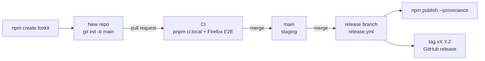
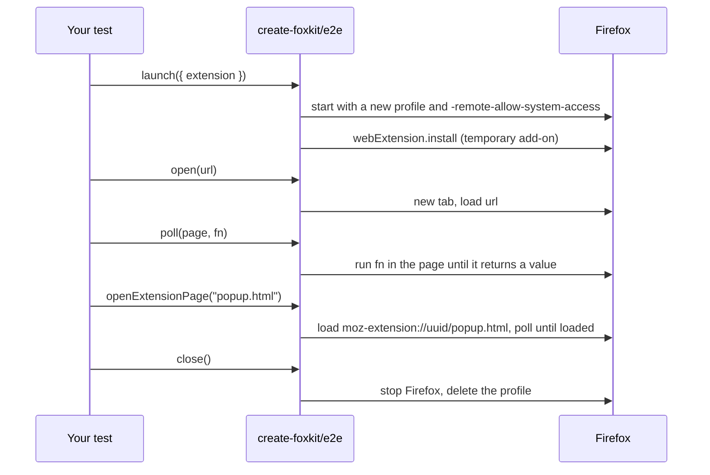
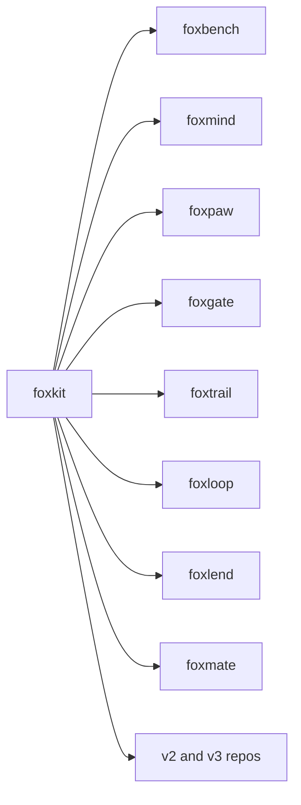

# foxkit

The template for fox repos: shared CI, Firefox E2E tests, and npm release.

foxkit has two parts. The `create-foxkit` command makes a new TypeScript repo
that is ready for CI and npm release. The `create-foxkit/e2e` library starts a
real Firefox with your extension installed, so a test can check what the
extension does.

## Install

```bash
npm i -D create-foxkit
```

You need this only for the E2E library. To make a repo, use `npm create`, as
the next section shows.

## Example

Make a repo with a test extension, then run its checks and its Firefox test:

```bash
npm create foxkit@latest foxdemo -- --prefix fdm --description "Say what foxdemo does in one sentence." --extension
cd foxdemo
pnpm install
pnpm ci:local
pnpm e2e
```

`pnpm e2e` builds `dist-e2e/` and runs `e2e/run.mjs`. This is the core of it.
It runs as written in a repo made with `--extension`, after
`node scripts/build-ext.mjs --e2e`:

```js
import { launch, poll, serve, writeArtifact } from "create-foxkit/e2e";

const site = await serve("e2e/site");
const fox = await launch({ extension: "dist-e2e" });
try {
  const page = await fox.open(`${site.url}/index.html`);
  const value = await poll(page, () => document.documentElement.dataset.fixture);
  console.log(writeArtifact("artifacts", "e2e", { value }));
} finally {
  await fox.close();
  await site.close();
}
```

## What a new repo gets

| Path | What it does |
|---|---|
| `package.json` | pnpm, ESM, Node 24 or later. Scripts: `build`, `typecheck`, `lint`, `test`, `ci:local`. |
| `tsconfig.json`, `.oxlintrc.json`, `vitest.config.ts` | TypeScript, oxlint and vitest. `pnpm ci:local` runs lint, typecheck, test and build. |
| `src/index.ts` | A one-line library. Replace it with your code. |
| `README.md` | The ten sections every fox repo has. Each part to write starts with `FILL:`. |
| `AGENTS.md` | The PR rules for your prefix, the layout and the commands. |
| `docs/failure-modes.md` | Where you list how the code can fail, before you write it. |
| `.github/workflows/ci.yml` | Runs `pnpm ci:local` on each pull request and each push to `main`. |
| `.github/workflows/release.yml` | On a push to `release`: refuses a version that has a tag, runs `pnpm ci:local`, publishes to npm with provenance, then tags `v<version>` and creates a GitHub release. |
| `.github/workflows/pr-standards.yml` | Checks the branch, title, body and size of each pull request. |
| `.github/ISSUE_TEMPLATE/`, `.agents/issues.md` | Bug, feature, chore and epic forms, and the issue rules. |
| `LICENSE` | MIT. |

With `--extension`, the repo also gets these:

| Path | What it does |
|---|---|
| `extension/` | A Manifest V3 extension for Firefox with an `action` popup that the repo fills in to show its primitive. Its name and titles are the repo name, and it has 48, 96 and 128 px icons. The gecko ID is `<name>@<owner>`, `strict_min_version` is `153.0`, and it declares `data_collection_permissions`. Its background script stores a value. It has no content script. |
| `scripts/build-ext.mjs` | Bundles `extension/` into `dist-ext/` with esbuild: the release build that AMO gets. With `--e2e` it writes `dist-e2e/` instead, which adds the E2E content script from `e2e/extension/`. It stops when the manifest version is not the `package.json` version. |
| `build:ext`, `lint:ext` scripts | `pnpm ci:local` also builds `dist-ext/` and runs `web-ext lint --warnings-as-errors` on it. |
| `extension/amo-metadata.json`, `scripts/amo-listing.mjs`, `check:amo` script | The AMO listing: name, summary, description, category, MIT license, links and notes for reviewers. `pnpm ci:local` runs `check:amo`, which stops on a listing that AMO refuses, on "demo", "test" or "fixture" in text that users see, on a manifest that declares data collection without a `privacy_policy`, and on a test-only piece in `dist-ext/`: a content script or host permission for `127.0.0.1`, `localhost` or `*.localhost` (unless `local_hosts` in the listing gives a reason), or a file named `e2e`, `fixture`, `test` or `spec`. Edit the description before the first release. |
| `e2e/run.mjs`, `e2e/site/`, `e2e/extension/` | The E2E test. It installs `dist-e2e/`, checks that the E2E content script marks a page on `127.0.0.1` and that the background stored a value, and writes `artifacts/e2e-<date>.json`. |
| `e2e` script, `create-foxkit` dev dependency | `pnpm e2e` builds `dist-e2e/` and runs the test. |
| AMO steps in `release.yml` | After the npm publish, `web-ext sign --channel=listed --amo-metadata` submits `dist-ext/` and the listing with the `AMO_JWT_ISSUER` and `AMO_JWT_SECRET` secrets, and uploads the `git archive` source for AMO review. A listed version waits for review, so web-ext runs with `--approval-timeout=0` and returns after the upload. Before the upload, `amo-listing.mjs version-status` asks AMO for the version: when AMO already has it as listed, a re-run skips `web-ext sign` and finishes the release. `amo-listing.mjs after-submit` then sends the privacy policy (when there is one) and the listing icon. The GitHub release says "Submitted for AMO review" and links to the listing; it has no `.xpi`. An empty secret stops the job with a clear error. |
| `pnpm-workspace.yaml` | Allows the esbuild build script, which pnpm 11 blocks by default. |
| An `e2e` job in `ci.yml` | Installs Firefox with `browser-actions/setup-firefox` and runs `pnpm e2e`. |

All GitHub Actions are pinned to commit SHAs.

## Use cases

| Who | What they build | How foxkit helps |
|---|---|---|
| A developer who starts a Firefox extension | An MV3 extension with tests from day one | `--extension` gives an extension with an AMO listing, a Firefox E2E test that also runs in CI, and an AMO submission on release. |
| The fox primitives maintainers | foxmind, foxpaw, foxgate and the other fox repos | Each repo starts with the same CI, release workflow and PR rules. |
| An author of a small library for AI agents | A TypeScript package on npm | The release workflow publishes with provenance and refuses to publish a version twice. |
| A team with an extension that has no browser tests | Firefox E2E tests in their own repo | `npm i -D create-foxkit`, then use `launch()` and `poll()` from `create-foxkit/e2e`. |
| A fleet of coding agents | New repos, made with no person at the keyboard | The command has no prompts. It refuses bad input and writes nothing in that case. |
| A benchmark author | A task suite that scores browser agents in Firefox | `serve()` hosts local task pages. `writeArtifact()` keeps each result as JSON. |

## How it works



The command reads `template/base` (and `template/extension` with
`--extension`) into memory and fills the placeholders. It writes the files
only when all input is valid, then runs `git init -b main`.

The E2E library drives Firefox through Puppeteer over WebDriver BiDi:



Two Firefox facts shape the library. WebDriver BiDi refuses `moz-extension:`
pages unless Firefox starts with `-remote-allow-system-access`. BiDi also sends
no navigation events for those pages, so `goto()` never resolves there. For
this reason `openExtensionPage()` polls `location.href` and
`document.readyState`.

## CLI

```text
create-foxkit <name> --prefix <p> --description "<one sentence>" [options]
```

| Option | Meaning |
|---|---|
| `<name>` | The directory and repo name. At most 60 lowercase letters, digits, `.`, `_` and `-`. |
| `--prefix <p>` | The PR and branch prefix, 2 to 5 lowercase letters. Required. |
| `--description <text>` | One sentence, at most 120 characters. Required. |
| `--package <name>` | The npm package name. The default is `<name>`. |
| `--owner <user>` | The GitHub owner. The default is `pooriaarab`. |
| `--extension` | Add the test extension, the `e2e` script and the E2E CI job. |
| `--foxkit <spec>` | The `create-foxkit` version for the `e2e` script. The default is `^<version of this create-foxkit>`. Use it with `--extension` only. |
| `-h`, `--help` | Show the help. |

The command exits 0 when it is done, 1 when `git init` fails, and 2 for bad
input. It refuses a target directory that is not empty. It has no prompts.

Template files use these placeholders: `__NAME__`, `__PACKAGE__`,
`__PREFIX__`, `__PREFIX_UPPER__`, `__DESCRIPTION__` and `__OWNER__`. In
`.json` files, the command escapes the values for JSON.

## API

All exports come from `create-foxkit/e2e`.

| Export | What it does |
|---|---|
| `launch(options)` | Starts Firefox with a new profile and installs the extension as a temporary add-on. Returns a `Fox`. |
| `poll(page, fn, arg?, timeoutMs = 30000)` | Runs `fn(arg)` in the page until it returns a truthy value, and returns that value. Throws after the timeout. |
| `serve(dir)` | Serves a directory on `http://127.0.0.1:<free port>`. Returns `{ url, close }`. Paths outside the directory get 404. |
| `writeArtifact(dir, name, data)` | Writes `data` as JSON to `<dir>/<name>-<YYYY-MM-DD>.json` (UTC date) and returns the path. |
| `findFirefox(path?)` | Returns the Firefox binary: `path`, then `FIREFOX`, then the usual install paths. Throws when there is none. |

`launch(options)` takes these options:

| Option | Meaning |
|---|---|
| `extension` | The extension directory. Its `manifest.json` must set `browser_specific_settings.gecko.id`. Required. |
| `firefox` | The Firefox binary. See `findFirefox`. |
| `headless` | Run with no window. The default is `true`. |
| `prefs` | More Firefox preferences. |

A `Fox` has these members:

| Member | What it does |
|---|---|
| `browser` | The Puppeteer `Browser`, for anything else. |
| `profile` | The temporary profile directory. |
| `extensionId` | The gecko ID from the manifest. |
| `extensionUrl(path?)` | Returns `moz-extension://<uuid>/<path>`. |
| `open(url)` | Opens the URL in a new tab, waits for the load event, and returns the Puppeteer `Page`. |
| `openExtensionPage(path, timeoutMs = 30000)` | Opens an extension page in a new tab and polls until it is loaded. |
| `close()` | Stops Firefox and deletes the profile. A second call does nothing. |

A function that you give to `poll()` or `page.evaluate()` runs in the page,
not in Node. It cannot use variables from outside it. Pass values through
`arg`.

foxkit has a CLI (`create-foxkit`) and a library. It has no MCP server.

## Firefox APIs used

| API | MDN | Why |
|---|---|---|
| WebDriver BiDi `webExtension.install` | [webExtension](https://developer.mozilla.org/en-US/docs/Web/WebDriver/Reference/BiDi/Modules/webExtension) | `launch()` installs the extension as a temporary add-on. |
| WebDriver BiDi `script` module | [script](https://developer.mozilla.org/en-US/docs/Web/WebDriver/Reference/BiDi/Modules/script) | `poll()` and `page.evaluate()` run functions in a page. |
| `-remote-allow-system-access` command-line flag | No MDN page | Lets BiDi reach `moz-extension:` pages. |
| `extensions.webextensions.uuids` preference | No MDN page | Fixes the extension UUID, so the `moz-extension:` URL is known before the add-on loads. |
| `browser_specific_settings` (`gecko.id`, `data_collection_permissions`) | [browser_specific_settings](https://developer.mozilla.org/en-US/docs/Mozilla/Add-ons/WebExtensions/manifest.json/browser_specific_settings) | The demo extension needs an ID and Firefox 153 (the current ESR). AMO requires the data collection key for new extensions. |
| `background.scripts` | [background](https://developer.mozilla.org/en-US/docs/Mozilla/Add-ons/WebExtensions/manifest.json/background) | The demo extension's background script (an event page). |
| `content_scripts` | [content_scripts](https://developer.mozilla.org/en-US/docs/Mozilla/Add-ons/WebExtensions/manifest.json/content_scripts) | The demo extension marks each page on `127.0.0.1`. |
| `runtime.onInstalled` | [runtime.onInstalled](https://developer.mozilla.org/en-US/docs/Mozilla/Add-ons/WebExtensions/API/runtime/onInstalled) | The demo extension stores its value at install time. |
| `action` popup | [action](https://developer.mozilla.org/en-US/docs/Mozilla/Add-ons/WebExtensions/manifest.json/action) | The page where a repo shows its primitive. The E2E test reads it. |
| `storage.local` | [storage.local](https://developer.mozilla.org/en-US/docs/Mozilla/Add-ons/WebExtensions/API/storage/local) | The demo extension stores a value and `popup.html` reads it. |

## Limits

- `create-foxkit` is not on npm until its first release. Until then, run the
  command from a checkout: `pnpm install && pnpm build`, then
  `node dist/cli.js <name> ...`.
- The template is fixed: pnpm, TypeScript, Node 24 or later, and GitHub
  Actions. There are no options for other tools.
- A repo does not get later template changes. There is no update command.
- `LICENSE` and the `author` field in `package.json` name Pooria Arab. Change
  both when the repo is yours.
- The E2E library works with Firefox only. It is tested with Firefox 157 on
  macOS.
- The E2E library installs temporary add-ons only. The AMO submission
  happens only in `release.yml`, and it has not run against AMO from this
  template yet.
- The release submits the extension after the npm publish. If the submission
  fails, run the release again: it skips the npm publish when that version is
  already on npm.
- AMO reviews a listed version before it signs it. The release does not wait
  for that review, so the signed file is on the AMO listing, not on the
  GitHub release.
- The release workflow needs the repository secret `NPM_TOKEN`. Without it,
  the publish step fails with a clear error.
- `writeArtifact()` names files by UTC date, so a second run on the same day
  replaces the file.

## Part of the fox primitives

foxkit depends on no fox repo. Every fox repo starts from it.



## Development

```bash
pnpm install
pnpm ci:local   # lint, typecheck, test, build
pnpm e2e        # scaffolds two repos and runs their checks and Firefox E2E
```

`pnpm e2e` writes `artifacts/e2e-<date>.json`. Set `FIREFOX` when Firefox is
not in the usual place.

## License

[MIT](LICENSE)
