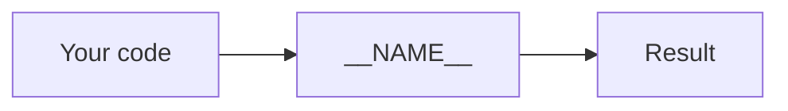
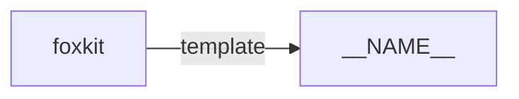

# __NAME__

__DESCRIPTION__

> FILL: Replace every line that starts with "FILL:" before the first release.
> Nothing in this README may be untrue. Every command must run.

## Install

```bash
npm i __PACKAGE__
```

## Example

```js
import { name } from "__PACKAGE__";

console.log(name);
```

> FILL: Replace this example with a short one that uses the real API. It must
> run as written.

## Use cases

| Who | What they build | How __NAME__ helps |
|---|---|---|
| FILL: a person or team | FILL: the thing they build | FILL: the part this repo does |
| FILL | FILL | FILL |
| FILL | FILL | FILL |
| FILL | FILL | FILL |
| FILL | FILL | FILL |

> FILL: Write at least 5 rows. Include uses outside foxmate.

## How it works



> FILL: Draw the real flow. Add a sequence or state diagram where it helps.

## API

| Export | What it does |
|---|---|
| `name` | The package name. Replace it with the real API. |

> FILL: Say if the repo also has a CLI (`bin`) or an MCP server. Document each
> one here, or write that there is none.

## Firefox APIs used

| API | MDN | Why |
|---|---|---|
| FILL: the API | FILL: the MDN link | FILL: why this repo uses it |

> FILL: List every WebExtension or web platform API the code uses.

## Limits

> FILL: Say what __NAME__ does not do yet. Be honest.

## Part of the fox primitives



> FILL: Add the repos this one depends on and the repos that use it. Link each
> one to `https://github.com/pooriaarab/<repo>`.

## License

[MIT](LICENSE)
